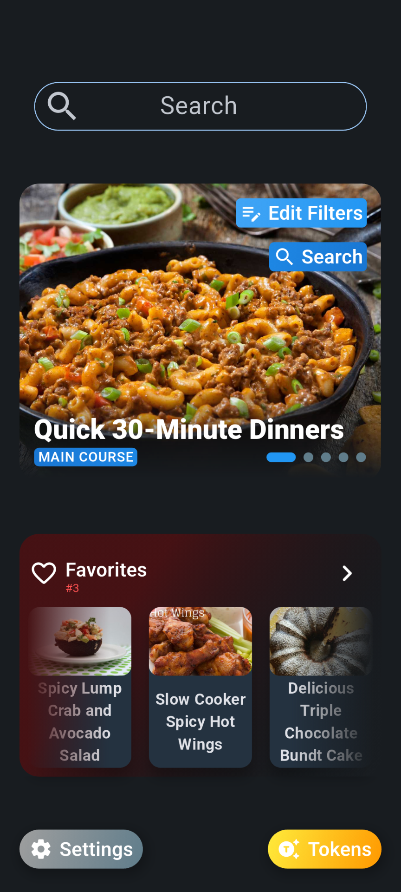

# Recipe Box

Discover delicious recipes effortlessly with this feature-packed recipe app powered by the Spoonacular API. Designed with simplicity and elegance in mind, the app offers advanced search filters, detailed nutritional data, and a favorites section to save your go-to meals. Its clean and intuitive interface ensures a seamless experience for everyone, including those less familiar with technology, such as older users. Whether you're a seasoned chef or a beginner, this app makes finding and cooking the perfect dish easy and enjoyable!

## Demo Video & Images

<iframe width="250" height="555.55" 
  src="https://www.youtube.com/embed/-mBlx2S-LpQ" 
  title="YouTube video player" 
  frameborder="0" 
  allow="accelerometer; autoplay; clipboard-write; encrypted-media; gyroscope; picture-in-picture" 
  allowfullscreen>
</iframe>

## Tech Stack Overview

<table>
  <tr>
    <td>State Management:</td>
    <td>Riverpod</td>
  </tr>
  <tr>
    <td>Android System:</td>
    <td>Material 3</td>
  </tr>
  <tr>
    <td>IOS System:</td>
    <td>Cupertino</td>
  </tr>
  <tr>
    <td>Architecture:</td>
    <td>Custom PFA</td>
  </tr>
  <tr>
    <td>API Integration:</td>
    <td>Spoonacular API</td>
  </tr>
  <tr>
    <td>Framework:</td>
    <td>Flutter Framework</td>
  </tr>
  <tr>
    <td>Navigation:</td>
    <td>Flutter Router</td>
  </tr>
  <tr>
    <td>Theming:</td>
    <td>Material 3 Dynamic Colors</td>
  </tr>
  <tr>
    <td>DataBase:</td>
    <td>ISAR</td>
  </tr>
  <tr>
    <td>Cross-Platform Support:</td>
    <td>Android, iOS, and Web</td>
  </tr>
</table>

